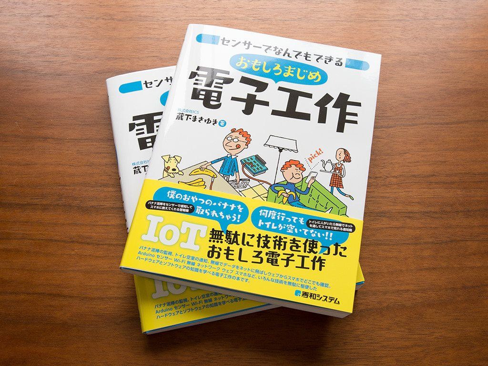
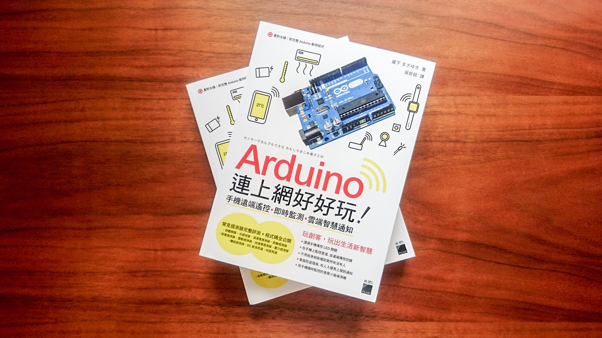

# Resume

[日本語版](./README.md) *(日本語版からClaude Codeで自動翻訳)*

## Basic Information

| Item | Details |
|---|---|
| Name | Masayuki Kurashita |
| GitHub | [@umi-kappa](https://github.com/umi-kappa) |
| X (Twitter) | [@umi_kappa](https://x.com/umi_kappa) |
| Zenn | [umi_kappa](https://zenn.dev/umi_kappa) |
| Qiita | [umi_kappa](https://qiita.com/umi_kappa) |

---

## About Me

With over 10 years of hands-on experience as a web frontend engineer, I specialize in designing and building UIs that users can operate intuitively without any explanation.

From selecting video player libraries to building custom joystick UIs from scratch, I am committed to making the best technology choices to deliver outstanding user experiences.

Currently, as Web Team Lead for the AI-powered English learning service "abceed," I have driven team growth from its early founding phase, taking on a broad range of responsibilities including hiring, technology selection, and project management.

To maintain high technical standards even with limited resources, I leverage AI-powered development tools such as Claude Code and CodeRabbit to maximize both team and individual productivity.

---

## Tech Stack

### Languages

| Technology | Proficiency | Notes |
|---|---|---|
| TypeScript | ⭐⭐⭐ Primary | 5+ years of professional experience |
| JavaScript | ⭐⭐⭐ Primary | 5+ years of professional experience |
| HTML / CSS | ⭐⭐⭐ Primary | 5+ years of professional experience |

### Frameworks & Libraries

| Technology | Proficiency | Notes |
|---|---|---|
| Vue.js | ⭐⭐⭐ Primary | 5+ years of professional experience |
| React | ⭐⭐⭐ Professional experience | 3+ years of professional experience |

---

## Work Experience & Projects

### Globee, Inc. (Mar 2021 – Present)

**Position:** Lead Frontend Engineer / Team Lead

#### Web Frontend Development for "abceed" — AI-Powered English Learning Service

**Period:** Mar 2021 – Present
**Role:** Frontend Lead

**Overview:**
Leading web frontend development for the AI-powered English learning service "abceed." Responsible for designing and implementing user-facing features and the admin dashboard. Proactively coordinated specifications with the design team, driving UI improvements from both usability and implementation perspectives.

**Challenges & Initiatives:**

- Needed to implement a DRM-compatible video player for a new movie/drama-based English learning feature
  - Rapidly built a prototype with hls.js to validate UI/UX with film studios
  - Migrated to Video.js for DRM (Widevine) support, but encountered playback freezing during high-speed phrase-level seeking
  - Ultimately migrated to Shaka Player, achieving both DRM compliance and seamless phrase-level playback
  - For details, see [Evolution of Video Libraries Used in abceed Web's Movie/Drama Feature Development](https://qiita.com/umi_kappa/items/f91eb2ed1ea3e0594992)
- Technical debt had accumulated in the existing Vue 2 codebase
  - Driving an incremental migration to Vue 3 in parallel with new feature development

**AI-Driven Development Efficiency (actively exploring and adopting):**

- Streamlined coding and PR reviews with Cursor and CodeRabbit
- Automated test generation with Claude Code; styling with Figma MCP
- Parallel development with Git Worktree, enabling progress on other tasks while awaiting code reviews

**Tech Stack:** TypeScript, Vue.js (Vuex / Pinia), Vite, webpack, Vitest, Storybook, GitHub Actions, AWS, Figma

---

#### Web Frontend Team Management & Organization Building

**Period:** Mar 2021 – Present
**Role:** Team Lead

**Overview:**
Served as Team Lead from the early founding phase of the web frontend team, driving team growth through hiring, task and resource management, and project coordination.

**Challenges & Initiatives:**

- As business requirements expanded, the development team needed to scale accordingly
  - Designed and created coding assessments, and conducted technical interviews
  - Contributed to successful team expansion
- Collaborated with the PdM to prioritize tasks and adjust specifications, then assigned team members and drove projects forward
  - When team members encountered blockers, broke down tasks and clarified specifications, and personally coordinated with the PdM and other teams to unblock progress
- Needed to balance leadership responsibilities with hands-on development in a lean team
  - Built custom PR review agents and release issue creation skills using Claude Code, automating routine leadership tasks
  - Maintained team management quality while preserving dedicated development time
- Git workflow rules and release processes had room for improvement
  - Revised branching strategy and streamlined release processes, improving deployment efficiency across the team

---

#### Corporate Website Development

**Period:** Mar 2023 – May 2023
**Role:** Implementation

**Overview:**
Built the [corporate website](https://www.globee.io/) from scratch with Nuxt.js in preparation for the company's IPO. Implemented responsive design for desktop and mobile based on designs from the design team. Balanced a trustworthy appearance befitting a publicly listed company with playful UI interactions. The IR page was hosted on a third-party provider's platform, where I maintained brand consistency within the constraints of their limited templates.

**Tech Stack:** TypeScript, Nuxt.js

---

### aptpod, Inc. (Oct 2017 – Feb 2021)

**Position:** Frontend Engineer

#### Remote Vehicle Control System — Web Application Development

**Period:** Jan 2019 – Mar 2019
**Role:** Frontend Development

**Overview:**
Developed a demo application for a major Japanese automaker that enabled remote control of an RC car via a smartphone web app. The key requirement was enabling sales representatives to operate it smoothly and responsively in front of clients.

**Challenges & Initiatives:**

- Initially adopted Hammer.js for the joystick UI, but faced issues with responsiveness and multi-touch support
  - Built a custom joystick UI from scratch optimized for touch interaction, delivering an intuitive control experience
- Collaborated closely with designers to refine UX details, such as fallback flows for error recovery
  - Achieved a UX where the client could operate the app without any instructions at delivery

**Tech Stack:** TypeScript, React, Redux, Jest, Storybook

---

#### Vehicle Telematics Device Status Viewer — Web Application (Bluetooth)

**Period:** Sep 2018 – Dec 2018
**Role:** Frontend Development (Design through Implementation)

**Overview:**
Developed a web application for checking the status of proprietary vehicle telematics devices via smartphone. Implemented offline capability using the Web Bluetooth API to enable operation without internet connectivity.

**Challenges & Initiatives:**

- Required functionality in environments without network connectivity
  - Achieved offline launch via ServiceWorker (Workbox) local caching and Web App Manifest
  - Implemented wireless communication with hardware (Read/Notification) using Web Bluetooth (BLE)
- Reference material for the Web Bluetooth API was extremely scarce, and the specification was still under development
  - Studied the BLE specification in depth, validated the unknown API from the ground up, and delivered a fully functional implementation

**Tech Stack:** TypeScript, React, Redux, ServiceWorker, Storybook

---

### ICS Inc. (Sep 2014 – Sep 2017)

**Position:** Frontend Engineer / Technical Writer

#### Technical Writing for ICS MEDIA

**Period:** Sep 2014 – Sep 2017
**Role:** Author

**Overview:**
Authored articles on interactive web experiences using JavaScript and IoT for the company's tech publication "ICS MEDIA."

**Results:**

- Articles published in 2017 accumulated 150,000 annual page views

**Tech Stack:** JavaScript, HTML5, CSS3, Arduino

---

#### Book: "[センサーでなんでもできる おもしろまじめ電子工作](https://www.shuwasystem.co.jp/book/9784798046600.html)" (Fun & Serious Electronics with Sensors)

**Period:** Oct 2016 – Jun 2017
**Role:** Planning, Writing & Demo Creation

**Overview:**
Authored an introductory book covering electronics fundamentals through IoT integration. The project was initiated by an editor who discovered my IoT articles on ICS MEDIA.

**Results:**

- 3rd printing, 3,600 copies sold
- Translated and published in Taiwan and China

**Tech Stack:** JavaScript, Arduino

---

## Other Activities

### Writing

- [Tips for "Invisible Animations" That Elevate User Experience](https://note.com/globee/n/n55c77911a184) (Globee note, 2021)
- [Taking Parental Leave at a 5-Engineer Startup — A Story of Gratitude](https://note.com/globee/n/nac4b1cac6792) (Globee note, 2022)
- [Reading and Writing NFC Tags with JavaScript Using Web NFC](https://tech.aptpod.co.jp/entry/2020/06/12/090000) (aptpod Tech Blog)
- [Practical Tips for 360° Video Player Development](https://tech.aptpod.co.jp/entry/2020/03/27/120000) (aptpod Tech Blog)
- [A Frontend Engineer's Design Review Checklist](https://tech.aptpod.co.jp/entry/2020/07/31/100000) (aptpod Tech Blog)
- [How Engineers Can Write User Manuals](https://tech.aptpod.co.jp/entry/2019/12/19/070000) (aptpod Tech Blog)

### Speaking

- Jan 2023: [Parenting Engineers LT Meetup](https://globee.connpass.com/event/269039/) — "Taking the First Parental Leave at a 5-Engineer Startup"

### Media Coverage

- [Rapid Growth Through AI English Learning, Company Culture Drawing Attention for Full Parental Leave Support](https://morejob.co.jp/mirai/globee/) (MoreJob interview, 2023)

---

*Last updated: 2026年3月1日*
