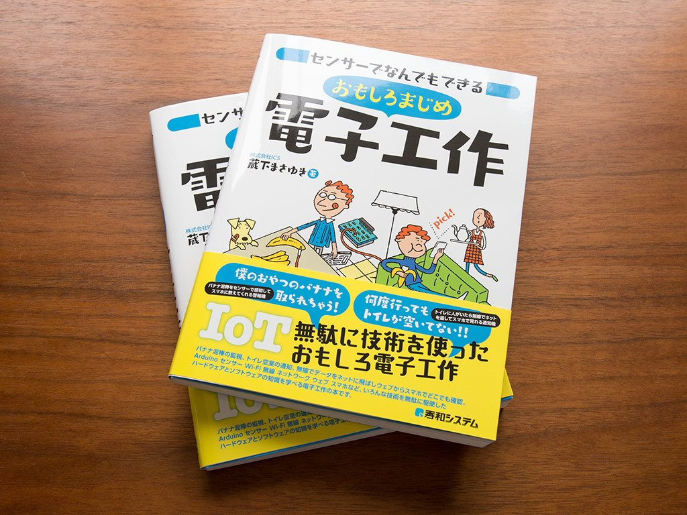
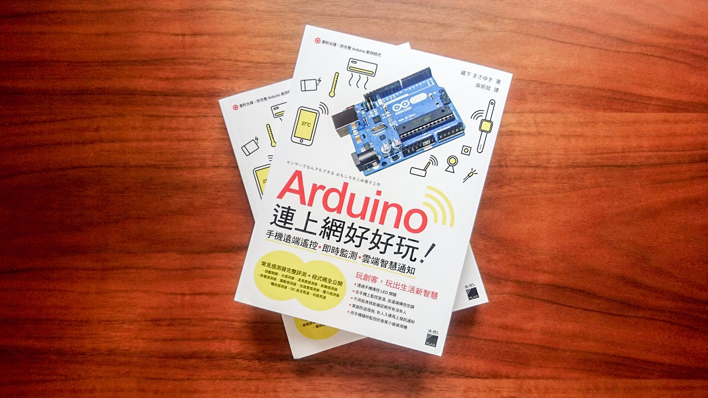

# Resume

[日本語版](./README.md)

## Basic Information

| Item | Details |
|---|---|
| Name | Masayuki Kurashita |
| GitHub | [@umi-kappa](https://github.com/umi-kappa) |
| LinkedIn | [umi-kappa](https://www.linkedin.com/in/umi-kappa/) |
| X (Twitter) | [@umi_kappa](https://x.com/umi_kappa) |
| Zenn | [umi_kappa](https://zenn.dev/umi_kappa) |
| Qiita | [umi_kappa](https://qiita.com/umi_kappa) |

---

## Summary & Strengths

I have 15 years of development experience, primarily in web frontend development, with strengths in taking work from requirements and UX discussions through UI design and implementation. I pursue usability with the goal of creating products that people can use without instructions.

From selecting video player libraries to developing a custom joystick UI from scratch, I have chosen technologies based on both user experience and feasibility, and turned those choices into working products.

Currently, as the Web Team Lead for "abceed," an AI-powered English learning service, I remain hands-on in development while also handling hiring, technology selection, requirements coordination, and project delivery.

Alongside using AI for development and reviews, I automate routine tasks and build reusable workflows for the team to improve productivity across the development process.

---

## Career Goals & Priorities

- **Elevate product value through frontend technology:**
  I want to contribute from the requirements and UX planning stages through UI implementation, using my technical knowledge to create products that people can use without instructions

- **Evolve development processes with AI:**
  I want to incorporate AI throughout requirements discussions, design, implementation, and reviews, beyond coding assistance alone, so engineers have more time to focus on products and users

- **Lead development through both technical decisions and project coordination:**
  I want to move product development forward by staying hands-on with implementation and technical decisions while also clarifying requirements, coordinating specifications, breaking down tasks, and working with stakeholders

- **Balance work and family:**
  I value flexible working arrangements that allow me to stay committed to my work and deliver results consistently while also spending time with my children

---

## Tech Stack

Experience as of September 2026

### Languages

| Technology | Professional Experience |
|---|---|
| TypeScript | Approx. 9 years of professional experience |
| JavaScript | Approx. 14 years of professional experience |
| HTML / CSS | Approx. 14 years of professional experience |

### Frameworks

| Technology | Professional Experience |
|---|---|
| Vue.js | Approx. 5 years of professional experience |
| React | Approx. 3 years of professional experience |

### State Management

- Vuex
- Pinia
- Redux

### Build & Development Tools

- Vite
- webpack

### Testing & Quality

- Vitest
- Storybook
- Chromatic
- GitHub Actions

### AI-Assisted Development

- Claude Code

---

## Work Experience & Projects

### Globee, Inc. (Mar 2021 – Present)

**Position:** Lead Frontend Engineer / Team Lead

#### Web Frontend Development for "abceed" — AI-Powered English Learning Service

**Period:** Mar 2021 – Present
**Role:** Frontend Lead

**Overview:**
Lead web frontend development for the AI-powered English learning service "abceed." Responsibilities include designing and implementing user-facing features and admin interfaces, clarifying requirements and improving UI/UX in collaboration with product managers and designers, and selecting technologies.

**Challenges & Initiatives:**

##### Requirements & UI Design for the Web

- Identified web-specific use cases in specifications and designs developed primarily for iOS / Android apps, including state management on reload, navigation guards, and multi-window use, and worked with product managers to define the requirements
- Collaborated with designers to adapt app-oriented designs for usability on the web, including desktop environments
- Proactively reviewed designs and implemented behavior, including projects outside my direct responsibilities, and provided feedback on responsive layouts, layouts in exceptional states, and use cases not explicitly covered by specifications

##### Video Player Development for Movie- and Drama-Based English Learning

- Needed a video player that supported both DRM and fast phrase-level seeking
- Built a prototype with hls.js to validate UI/UX, then adopted Video.js for DRM support
- Investigated playback freezes during fast seeking and ultimately migrated to Shaka Player, achieving both DRM support and seamless phrase playback
- For details, see [Evolution of Video Libraries Used in abceed Web's Movie/Drama Feature Development](https://qiita.com/umi_kappa/items/f91eb2ed1ea3e0594992)

**Tech Stack:** TypeScript, Vue.js, Vuex, Pinia, Vite, webpack, Vitest, Storybook, Chromatic, GitHub Actions, Shaka Player

---

#### Web Frontend Team Leadership & Development Process Improvement

**Period:** Mar 2021 – Present
**Role:** Team Lead

**Overview:**
Responsible for project delivery, hiring, and establishing development and review environments since the web frontend team's early stages. Lead development across the team while remaining hands-on.

**Challenges & Initiatives:**

##### Project Delivery & Delegation

- In the team's early stages, handled a broad range of project activities: clarifying requirements and specifications, researching technologies, considering UI/UX, designing URL structures, creating issues, assigning tasks, reviewing PRs, and verifying implementations before QA
- As development volume increased, gradually delegated project coordination to team members, including requirements clarification and reviews
- Currently monitor project progress and team members' challenges, providing support and coordination on requirements and technical matters as needed

##### Development Process Improvement with AI

- Introduced Claude Code into day-to-day development and use it throughout the process, from preparing design and implementation plans based on requirements to implementation, testing, and code reviews
- Automated recurring tasks, such as generating API-related files in batches and reviewing PRs, as reusable Claude Code Skills
- Share Skills in the repository and continually refine them as a common team workflow, discussing and improving ideas together with team members

##### Component Development & Review Process Improvement

- Checking a specific component in a complex application required navigating through screens and recreating application state
- Proposed introducing Storybook and established an environment for checking component UIs and behavior individually without operating the entire application
- Based on a team member's proposal, worked with the team to establish a Chromatic workflow that detects unintended UI changes through Visual Regression Testing and supports PR reviews using an online Storybook

##### Frontend Engineer Hiring

- Responsible for improving and administering coding assessments and conducting technical interviews for senior frontend engineer hiring
- Updated assessments in response to the wider adoption of AI implementation assistance to evaluate candidates' ability to clarify ambiguous requirements and turn them into specifications, alongside implementation skills

---

#### Corporate Website Development

**Period:** Mar 2023 – May 2023
**Role:** Implementation

**Overview:**
Built the [corporate website](https://www.globee.io/) from scratch with Nuxt in preparation for the company's IPO. Implemented responsive design for desktop and mobile based on designs from the design team. Balanced a trustworthy appearance befitting a publicly listed company with playful UI interactions.

**Tech Stack:** TypeScript, Nuxt

---

### aptpod, Inc. (Oct 2017 – Feb 2021)

**Position:** Frontend Engineer

**Overview:**
Responsible for web frontend development for the company's IoT and automotive products. Developed web applications with React / TypeScript, primarily customizing the company's products and building specific features to meet client requirements. The following are representative projects that can be disclosed publicly.

#### Remote Vehicle Control System — Web Application Development

**Period:** Jan 2019 – Mar 2019
**Role:** Frontend Development

**Overview:**
Developed a system for controlling a portable RC car through a web application as a technical demonstration of smartphone-based remote control for a client's heavy machinery. For demonstrations at client sites, the UI needed to be intuitive and smooth to operate without instructions.

**Challenges & Initiatives:**

- Initially adopted Hammer.js for the joystick UI, but encountered issues with responsiveness and multi-touch support
  - Built a custom joystick UI from scratch optimized for touch interaction, delivering intuitive controls
- Collaborated with a designer on UX details, including flows that made it easy to recover from failed operations
  - Delivered a UI that the client could operate without instructions

**Tech Stack:** TypeScript, React, Redux, Storybook

---

#### Technical Validation & Development of an Offline Web Application for an In-Vehicle Device

**Period:** Sep 2018 – Dec 2018
**Role:** Frontend Development (Design through Implementation)

**Overview:**
Responsible for technical validation and development of a product that allowed users to view data from the company's in-vehicle device on a smartphone, even without an internet connection.

**Challenges & Initiatives:**

- Developed a prototype using the Web Bluetooth API to retrieve data from the in-vehicle device on a smartphone without relying on a network
  - Researched specifications and implemented BLE data communication at a time when examples and information were scarce
  - Testing with physical devices showed that meeting the product's stability requirements would be difficult, providing evidence to inform technology selection
- Based on the findings, the team reconsidered the approach and switched to an architecture in which smartphones directly accessed a web application served by the in-vehicle device
  - Designed and implemented the frontend, delivering a web UI for viewing device information without relying on an internet connection

**Tech Stack:** TypeScript, React, Redux, Storybook, Web Bluetooth API

---

### ICS Inc. (Sep 2014 – Sep 2017)

**Position:** Frontend Engineer / Technical Writer

**Overview:**
Responsible for frontend development of campaign websites and web applications with extensive interactive features, primarily for client projects. In addition to JavaScript / HTML / CSS, developed content with Adobe Flash / ActionScript 3.0. Alongside development, wrote articles for the company's technical publication "ICS MEDIA" and authored a book.

#### Ongoing Development & Operations for the Social Game "パズ億"

**Period:** Sep 2014 – Sep 2017
**Role:** Development & Operations

**Overview:**
Responsible for ongoing development and operations of "パズ億," a puzzle game built with Adobe AIR. In addition to implementing and updating features, created puzzle stages, supporting continued operations through both technology and content development.

**Tech Stack:** ActionScript 3.0, Adobe AIR

---

#### Technical Writing for ICS MEDIA

**Period:** Sep 2014 – Sep 2017
**Role:** Author

**Overview:**
Authored articles on interactive web experiences using JavaScript and IoT for the company's tech publication "ICS MEDIA."

**Main Technical Areas:** JavaScript, HTML, CSS, Arduino

---

#### Book: "[センサーでなんでもできる おもしろまじめ電子工作](https://www.shuwasystem.co.jp/book/9784798046600.html)" (Fun & Serious Electronics with Sensors)

**Period:** Oct 2016 – Jun 2017
**Role:** Planning, Writing & Demo Creation

**Overview:**
Authored an introductory book covering electronics fundamentals through IoT integration. The project was initiated by an editor who discovered my IoT articles on ICS MEDIA.

**Results:**

- 3rd printing, 3,600 copies in total
- Translated and published in Taiwan and China

**Main Technical Areas:** JavaScript, Arduino

---

### CASE Inc. / Bunnyhop Inc. (now BH Inc.) (Sep 2012 – Aug 2014)

**Position:** Frontend Engineer

**Overview:**
Shifted from developing interactive content primarily with Adobe Flash to web frontend development centered on JavaScript / HTML / CSS. Alongside campaign website production, handled frontend development for BtoB projects, including business applications and surveillance camera systems.

Transferred from CASE Inc. to Bunnyhop Inc. in May 2014, continuing work with the same team.

**Tech Stack:** JavaScript, HTML, CSS

---

### SONICJAM Inc. (Oct 2010 – Aug 2012)

**Position:** Flash Developer

**Overview:**
Produced interactive content with Adobe Flash / ActionScript 3.0, primarily for corporate campaign websites.

Built animations and interactions from static visual designs, gaining experience in refining UI motion and usability through reviews from senior colleagues and supervisors.

Joined as an intern in October 2010 and became a full-time employee in April 2011.

**Tech Stack:** ActionScript 3.0, Adobe Flash

---

## Technical Learning & Personal Projects

### Personal Development (Apr 2026 – Present)

**Position:** Frontend Engineer

#### [PeakRM](https://github.com/umi-kappa/peak-rm) — Training Log & 1RM Visualization Web App

**Period:** Apr 2026 – Present
**Role:** Planning, Design & Implementation

**Overview:**
Independently developing a web app that combines training logs, progress visualization using estimated 1RM, and rest interval management to address the inconvenience of keeping training records on paper and using a separate timer app. Responsible end to end for product planning, requirements definition, UX design, UI design, architecture, and implementation. Currently under development in preparation for release.

**Challenges & Initiatives:**

- **Design & UI Consistency in AI-Assisted Development**
  - Established a [specification](https://github.com/umi-kappa/peak-rm/blob/main/docs/spec.md), [coding conventions](https://github.com/umi-kappa/peak-rm/blob/main/docs/conventions.md), and [design documentation](https://github.com/umi-kappa/peak-rm/tree/main/docs/design) to maintain consistent design decisions, implementation practices, and UI when developing with AI
  - Manage UI guidelines and decision criteria in design documentation instead of using design tools such as Figma

- **UI/UX Design for Use During Training**
  - Designed a UI that brings logging, progress checks, and rest interval timing into one app, prioritizing straightforward operation during the short breaks between sets
  - Defined the necessary features and interaction flows from usage scenarios based on how I currently record workouts and manage rest intervals at the gym

- **Local-First Architecture & Offline Support**
  - Adopted an architecture that does not require a constant backend connection to limit development costs before release and support use in gyms with unreliable connectivity
  - Implemented a local-first PWA using IndexedDB (Dexie), enabling offline use without login

**Tech Stack:** TypeScript, Vue.js, Vite, IndexedDB (Dexie), PWA, Chart.js, Vitest, Storybook, Chromatic, GitHub Actions

---

## Technical Writing

### Articles

- [Custom Claude Code Skills I Use for Web Frontend Development](https://zenn.dev/umi_kappa/articles/fd63a0792d8fe3) (Zenn, 2026)
- [Tips for "Invisible Animations" That Elevate User Experience](https://note.com/globee/n/n55c77911a184) (Globee note, 2021)
- [Practical Tips for 360° Video Player Development](https://tech.aptpod.co.jp/entry/2020/03/27/120000) (aptpod Tech Blog)
- [A Frontend Engineer's Design Review Checklist](https://tech.aptpod.co.jp/entry/2020/07/31/100000) (aptpod Tech Blog)

---

*Last updated: September 15, 2026*
