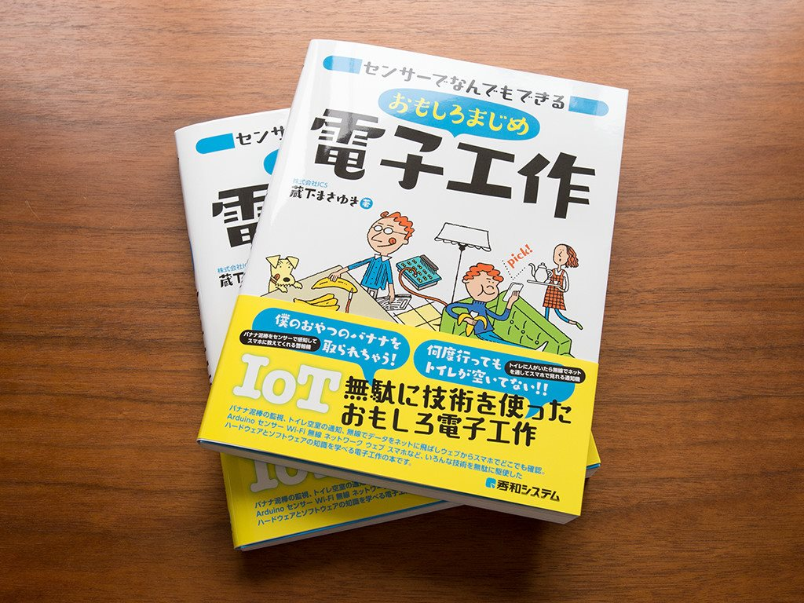
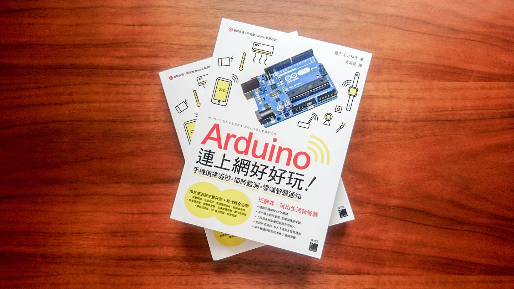

# Resume

[日本語版](./README.md)

## Basic Information

| Item | Details |
|---|---|
| Name | Masayuki Kurashita |
| GitHub | [@umi-kappa](https://github.com/umi-kappa) |
| LinkedIn | [umi-kappa](https://www.linkedin.com/in/umi-kappa/) |
| X (Twitter) | [@umi_kappa](https://x.com/umi_kappa) |
| Zenn | [umi_kappa](https://zenn.dev/umi_kappa) |
| Qiita | [umi_kappa](https://qiita.com/umi_kappa) |

---

## Summary & Strengths

I have 15 years of development experience, primarily in web frontend development. My strengths lie in working across requirements and UX discussions, UI design, and implementation. Whether users can use a product without instructions is one of the criteria that guide my approach to usability.

From selecting video player libraries to developing a custom joystick UI from scratch, I have chosen technologies based on both user experience and technical feasibility, and turned those choices into working products.

Currently, as the Web Team Lead for "abceed," an AI-powered English learning service, I remain hands-on in development while also handling hiring, technology selection, requirements coordination, and project delivery.

I use AI in development and reviews to improve productivity across the development process. I also work on automating routine tasks and building reusable workflows for the team.

---

## What I Value in Development

### Pursuing UIs That Need No Instructions

Since my days working with Flash, I have cared about creating UIs that people can use without having to think about the controls themselves. Even with a single button, I want to create something pleasant that people naturally want to interact with, rather than using flashy animations to draw attention and get them to click. I believe these small moments of ease add up to a UI that needs no instructions.

Rather than simply implementing the specifications and designs in front of me, I continually ask whether users might get lost or find something difficult to use. When I notice a problem, I bring a proposed improvement to the product manager and designer, and work with them to keep making the UI easier to use without instructions.

### Try It First. If It Fails, Try Another Way

When adopting new technology or unsure whether an approach is feasible, I take a "try it first" mindset and build a prototype to test it. Even if it fails, there is value in learning that a particular approach does not work. I can try another way next. This is how I have approached technology selection and feasibility decisions.

I share what I have learned and how I reached my decisions within the team and through technical articles, hoping to help others facing the same uncertainties.

### Creating an Environment That Makes Development Easier for the Team

I have worked across the development process, from clarifying requirements and creating and assigning tasks to reviews and verification before QA. As AI adoption increases the volume of development, I have been handing over responsibilities to team members, discussing specifications with them, and helping resolve obstacles to progress. Alongside my own development work, I value creating the conditions for team members to make decisions and move work forward themselves.

---

## Career Goals

### Elevate Product Value Through Frontend Technology

I want to contribute from the requirements and UX planning stages through UI implementation, using my technical knowledge to create products that people can use without instructions.

### Evolve Development Processes with AI

I want to use AI throughout requirements discussions, design, implementation, and reviews so engineers have more time to focus on products and users. Alongside individual use, I want to build ways for the team to use AI effectively.

### Lead Development Through Both Technical Decisions and Project Coordination

I want to move the team's development forward while staying hands-on with implementation and technical decisions. I also want to contribute to clarifying requirements, coordinating specifications, breaking down tasks, working with stakeholders, and supporting team members.

---

## What I Look for in a Workplace

### Take Ownership of Product and Technology Decisions

I am looking for an environment where I can contribute before implementation, including specification and UX discussions and technology selection, and apply my frontend expertise to product development.

### Balance Work and Family

I want to stay committed to my work while also valuing time with my children. I am looking for flexible working arrangements that allow me to deliver results consistently.

---

## Tech Stack

Experience as of September 2026

### Languages

| Technology | Professional Experience |
|---|---|
| TypeScript | Approx. 9 years of professional experience |
| JavaScript | Approx. 14 years of professional experience |
| HTML / CSS | Approx. 14 years of professional experience |

### Frameworks

| Technology | Professional Experience |
|---|---|
| Vue.js | Approx. 5 years of professional experience |
| React | Approx. 3 years of professional experience |

### State Management

- Vuex
- Pinia
- Redux

### Build & Development Tools

- Vite
- webpack

### Testing & Quality

- Vitest
- Storybook
- Chromatic
- GitHub Actions

### AI-Assisted Development

- Claude Code

---

## Work Experience & Projects

### Globee, Inc. (Mar 2021 – Present)

**Position:** Lead Frontend Engineer / Team Lead

#### Web Frontend Development for "abceed" — AI-Powered English Learning Service

**Period:** Mar 2021 – Present
**Role:** Frontend Lead

**Overview:**
Lead web frontend development for the AI-powered English learning service "abceed." Responsibilities include designing and implementing user-facing features and admin interfaces, clarifying requirements and improving UI/UX in collaboration with product managers and designers, and selecting technologies.

The web version I work on is used for individual English study, corporate training, and TOEIC and Eiken preparation in schools. It supports learning on school Chromebooks and larger PC screens. It also provides access from social media and other services, as well as web-only features.

**Challenges & Initiatives:**

##### Requirements & UI Design for the Web

- For many shared features, specifications and designs were considered first for the more widely used iOS / Android apps, with the web version designed afterward. Web-only features were considered for the web from the outset. The web team had the same headcount as each app team while also developing admin interfaces, leaving limited staffing for its scope
- Reviewed designs before implementation to avoid rework. Identified web-specific use cases, including state management on reload, navigation guards, and handling the browser losing focus, and worked with product managers and designers to define specifications and UI behavior
- Proactively reviewed designs and post-implementation behavior in projects outside my direct responsibilities, and provided feedback on responsive layouts, layouts in exceptional states, and use cases not explicitly covered by specifications

##### UI Improvements for the Free-Talk Feature in AI English Conversation (Released in Summer 2026)

- The proposed design showed scenario details on a separate screen, requiring users to return to the list each time they wanted to choose a different scenario. To reduce this effort, proposed showing the details in a modal on the list screen
- A PC screen provided enough space to show the details in a modal, while a separate screen required consideration of display behavior and data retrieval on reload. Shared these points with the designer, and the proposal was adopted
- Users could review details and change their selection without leaving the list, reducing screen transitions. Reusing data already fetched for the list also eliminated the additional API request that had been planned

##### Video Player Development for Movie- and Drama-Based English Learning (Released in Spring 2023)

- Needed to meet film companies' licensing requirements for DRM copyright protection while allowing learners to move to lines of dialogue and listen to them again smoothly
- Built a prototype with hls.js to reuse existing HLS assets and validate UI/UX suited to learning early in development. Also used it to demonstrate the learning experience to representatives from film companies
- Adopted Video.js for DRM support in the production implementation, but playback stopped when starting partway through a video and rapidly stepping backward through phrases beyond that starting point. Investigation did not resolve the issue, so prioritized the learning experience of smoothly replaying dialogue and reconsidered the library choice
- Investigated open-source and commercial DRM-capable libraries and tested Shaka Player, which offered extensive DRM examples. Confirmed that playback resumed promptly even with the operations that caused problems in Video.js, then adopted it to resolve the playback freezes. Achieved both copyright protection and smooth phrase playback
- For details, see [Evolution of Video Libraries Used in abceed Web's Movie/Drama Feature Development](https://qiita.com/umi_kappa/items/f91eb2ed1ea3e0594992)

##### Improving Social Sharing

- The learning-progress sharing feature required users to manually attach a browser-generated image to a social media post. Had recognized this extra step as a usability issue since implementing the feature
- When the feature was revisited, proposed to the CTO, who also served as product manager, an approach that passes a shared page URL to the social platform. This involved generating a shared page with OGP metadata reflecting the learning results. Also proposed adding a link to abceed on the shared page so people viewing the post could visit the service
- Investigated OGP behavior in advance and implemented the shared page's HTML template and the client-side sharing interaction. The server team considered the server-side implementation. Developed the feature in consultation with that team on details such as the data format passed to the template
- Released the feature so the share button in abceed opens a social media post composer with the shared URL already filled in. Removed the need to attach an image manually, reducing the effort required to share learning results

**Tech Stack:** TypeScript, Vue.js, Vuex, Pinia, Vite, webpack, Vitest, Storybook, Chromatic, GitHub Actions, Shaka Player

---

#### Web Frontend Team Leadership & Development Process Improvement

**Period:** Mar 2021 – Present
**Role:** Team Lead

**Overview:**
Responsible for project delivery, hiring, and establishing development and review environments since the web frontend team's early stages. Lead development across the team while remaining hands-on.

The web team had 2 members, including myself, when I joined. It later grew to a maximum of 4 and currently has 3. 1 additional contractor participated during the period when the team had 2 members. Projects involve collaboration with iOS, Android, and server engineers, designers, product managers, QA, and other colleagues.

**Challenges & Initiatives:**

##### Project Delivery & Delegation

- In the team's early stages, handled a broad range of project activities: clarifying requirements and specifications, researching technologies, considering UI/UX, designing URL structures, creating issues, assigning tasks, reviewing PRs, and verifying implementations before QA
- As AI adoption increased, the company sought to pursue more projects and the volume of reviews grew. While I also had my own development responsibilities, specification coordination and reviews consumed more of my time, increasingly delaying my assigned projects
- Since 2026, have gradually delegated project coordination to team members, including defining specifications, coordinating designs, and conducting reviews
- Currently monitor each project's progress and challenges, answer questions about existing specifications, and provide design guidance. Also coordinate with stakeholders on behalf of team members when needed. While continuing this support, have begun to regain time for my own development work

##### Introducing a Checklist to Prevent Gaps in Web Specifications and Designs

- On many projects, iOS engineers, designers, and product managers discussed specifications and designs before web team members joined. Web requirements and designs were often still unresolved when the web team joined, preventing implementation from starting immediately
- Discussed these difficulties with the CTO and proposed a checklist so web-specific considerations could be reviewed in advance, even when web team members were not involved from the beginning
- Documented considerations in Notion, including behavior on reload and direct URL access, hover designs, and responses to changes in screen width. Proposed having AI reference this material to check for omissions during specification and design discussions, and obtained the CTO's agreement
- Product managers and engineers involved early in projects began using the checklist for AI-assisted checks. Reload behavior was discussed in advance, and hover designs were increasingly prepared before web team members joined

##### Development Process Improvement with AI

- Introduced Claude Code into day-to-day development in 2026 and use it throughout the process, from preparing design and implementation plans based on requirements to implementation, testing, and code reviews
- Documented procedures for recurring development tasks, such as generating API-related files in batches and reviewing PRs, as Claude Code Skills to support reuse and automation
- Since 2026, have shared Skills in the repository and continually refined them as a common team workflow, discussing and improving ideas together with team members

##### Frontend Engineer Hiring

- Responsible for improving and administering coding assessments and conducting technical interviews for senior frontend engineer hiring
- Since 2026, have updated assessments in response to the wider adoption of AI implementation assistance to evaluate candidates' ability to clarify ambiguous requirements and turn them into specifications, alongside implementation skills

##### Component Development & Review Process Improvement

- Checking a specific component in the application required navigating through screens and recreating the necessary state
- Proposed and introduced Storybook when I joined in March 2021, establishing an environment for checking component UIs and behavior individually without operating the entire application
- Introduced Chromatic in 2025 based on a team member's proposal and established its workflow together with the team. Enabled detection of unintended UI changes through Visual Regression Testing and PR reviews using an online Storybook

---

#### Corporate Website Development

**Period:** Mar 2023 – May 2023
**Role:** Implementation

**Overview:**
Built the [corporate website](https://www.globee.io/) from scratch with Nuxt in preparation for the company's IPO. Implemented responsive design for desktop and mobile based on designs from the design team. Balanced a trustworthy appearance befitting a publicly listed company with playful UI interactions.

**Tech Stack:** TypeScript, Nuxt

---

### aptpod, Inc. (Oct 2017 – Feb 2021)

**Position:** Frontend Engineer

**Overview:**
Responsible for web frontend development for the company's IoT and automotive products. Developed web applications with React / TypeScript, primarily customizing the company's products and building specific features to meet client requirements. The following are representative projects that can be disclosed publicly.

#### Remote Vehicle Control System — Web Application Development

**Period:** Jan 2019 – Mar 2019
**Role:** Frontend Development

**Overview:**
Developed a technical demonstration system to show that a client's heavy machinery could be controlled remotely from a smartphone. The system used a web application to control a portable RC car. For demonstrations at client sites, the UI needed to be intuitive and smooth to operate without instructions.

**Challenges & Initiatives:**

- Initially adopted Hammer.js for the joystick UI, but encountered issues with responsiveness and multi-touch support
  - Built a custom joystick UI from scratch optimized for touch interaction, delivering intuitive controls
- Collaborated with a designer on UX details, including flows that made it easy to recover from failed operations
  - Delivered a UI that the client could operate without instructions

**Tech Stack:** TypeScript, React, Redux, Storybook

---

#### Technical Validation & Development of an Offline Web Application for an In-Vehicle Device

**Period:** Sep 2018 – Dec 2018
**Role:** Frontend Development (Design through Implementation)

**Overview:**
Responsible for technical validation and development of a product that allowed users to view data from the company's in-vehicle device on a smartphone, even without an internet connection.

**Challenges & Initiatives:**

- Developed a prototype using the Web Bluetooth API to retrieve data from the in-vehicle device on a smartphone without an internet connection
  - Researched specifications and implemented BLE data communication at a time when examples and information were scarce
  - Testing with physical devices showed that meeting the product's stability requirements would be difficult, providing evidence to inform technology selection
- Based on the findings, the team reconsidered the approach and switched to an architecture in which smartphones directly accessed a web application served by the in-vehicle device
  - Designed and implemented the frontend, delivering a web UI for viewing device information without relying on an internet connection

**Tech Stack:** TypeScript, React, Redux, Storybook, Web Bluetooth API

---

### ICS Inc. (Sep 2014 – Sep 2017)

**Position:** Frontend Engineer / Technical Writer

**Overview:**
Responsible for frontend development of campaign websites and web applications with extensive interactive features, primarily for client projects. In addition to JavaScript / HTML / CSS, developed content with Adobe Flash / ActionScript 3.0. Alongside development, wrote articles for the company's technical publication "ICS MEDIA" and authored a book.

#### Ongoing Development & Operations for the Social Game "パズ億"

**Period:** Sep 2014 – Sep 2017
**Role:** Development & Operations

**Overview:**
Responsible for ongoing development and operations of "パズ億," a puzzle game built with Adobe AIR. In addition to implementing and updating features, created puzzle stages, supporting continued operations through both technology and content development.

**Tech Stack:** ActionScript 3.0, Adobe AIR

---

#### Technical Writing for ICS MEDIA

**Period:** Sep 2014 – Sep 2017
**Role:** Author

**Overview:**
Authored articles on interactive web experiences using JavaScript and IoT for the company's tech publication "ICS MEDIA."

**Main Technical Areas:** JavaScript, HTML, CSS, Arduino

---

#### Book: "[センサーでなんでもできる おもしろまじめ電子工作](https://www.shuwasystem.co.jp/book/9784798046600.html)" (Fun & Serious Electronics with Sensors)

**Period:** Oct 2016 – Jun 2017
**Role:** Planning, Writing & Demo Creation

**Overview:**
Authored an introductory book covering electronics fundamentals through IoT integration. The project was initiated by an editor who discovered my IoT articles on ICS MEDIA.

**Results:**

- 3rd printing, 3,600 copies in total
- Translated and published in Taiwan and China

**Main Technical Areas:** JavaScript, Arduino

---

### CASE Inc. / Bunnyhop Inc. (now BH Inc.) (Sep 2012 – Aug 2014)

**Position:** Frontend Engineer

**Overview:**
Shifted from developing interactive content primarily with Adobe Flash to web frontend development centered on JavaScript / HTML / CSS. Alongside campaign website production, handled frontend development for BtoB projects, including business applications and surveillance camera systems.

Transferred from CASE Inc. to Bunnyhop Inc. in May 2014, continuing work with the same team.

**Tech Stack:** JavaScript, HTML, CSS

---

### SONICJAM Inc. (Oct 2010 – Aug 2012)

**Position:** Flash Developer

**Overview:**
Produced interactive content with Adobe Flash / ActionScript 3.0, primarily for corporate campaign websites.

Built animations and interactions from static visual designs. Gained experience refining UI motion and usability through reviews from senior colleagues and supervisors.

Joined as an intern in October 2010 and became a full-time employee in April 2011.

**Tech Stack:** ActionScript 3.0, Adobe Flash

---

## Technical Learning & Personal Projects

### Personal Development (Apr 2026 – Present)

**Position:** Frontend Engineer

#### [PeakRM](https://github.com/umi-kappa/peak-rm) — Training Log & 1RM Visualization Web App

**Period:** Apr 2026 – Present
**Role:** Planning, Design & Implementation

**Overview:**
Independently developing a web app that combines training logs, progress visualization using estimated 1RM, and rest interval management. For my own training, I kept records on paper and used a separate app to time rest intervals. I started building the app to address this inconvenience. Responsible end to end for product planning, requirements definition, UX design, UI design, architecture, and implementation. Currently under development in preparation for release.

**Challenges & Initiatives:**

- **Design & UI Consistency in AI-Assisted Development**
  - Established a [specification](https://github.com/umi-kappa/peak-rm/blob/main/docs/spec.md), [coding conventions](https://github.com/umi-kappa/peak-rm/blob/main/docs/conventions.md), and [design documentation](https://github.com/umi-kappa/peak-rm/tree/main/docs/design) to support AI-assisted development. Built a development environment that maintains consistency in design decisions, implementation practices, and UI
  - Manage UI guidelines and decision criteria in design documentation instead of using design tools such as Figma

- **UI/UX Design for Use During Training**
  - Designed the necessary features and interaction flows based on situations in which I record workouts and manage rest intervals at the gym
  - Designed a UI that brings logging, progress checks, and rest interval timing into one app so users can operate it without confusion during the short breaks between sets

- **Local-First Architecture & Offline Support**
  - Adopted an architecture that does not require a constant backend connection to limit development costs before release and support use in gyms with unreliable connectivity
  - Implemented a local-first PWA using IndexedDB (Dexie), enabling offline use without login

**Tech Stack:** TypeScript, Vue.js, Vite, IndexedDB (Dexie), PWA, Chart.js, Vitest, Storybook, Chromatic, GitHub Actions

---

## Technical Writing

### Articles

- [Custom Claude Code Skills I Use for Web Frontend Development](https://zenn.dev/umi_kappa/articles/fd63a0792d8fe3) (Zenn, 2026)
- [Tips for "Invisible Animations" That Elevate User Experience](https://note.com/globee/n/n55c77911a184) (Globee note, 2021)
- [Practical Tips for 360° Video Player Development](https://tech.aptpod.co.jp/entry/2020/03/27/120000) (aptpod Tech Blog)
- [A Frontend Engineer's Design Review Checklist](https://tech.aptpod.co.jp/entry/2020/07/31/100000) (aptpod Tech Blog)

---

*Last updated: September 26, 2026*
